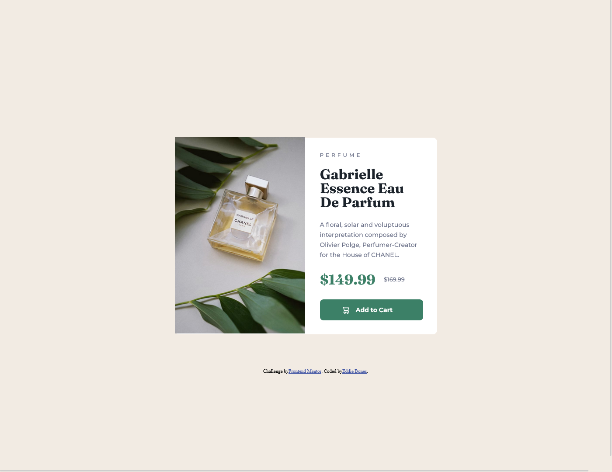
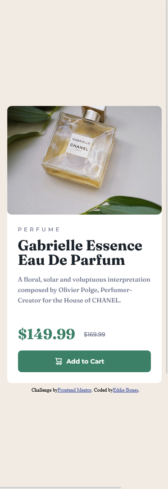

# Frontend Mentor - Product preview card component solution

This is a solution to the [Product preview card component challenge on Frontend Mentor](https://www.frontendmentor.io/challenges/product-preview-card-component-GO7UmttRfa). Frontend Mentor challenges help you improve your coding skills by building realistic projects. 

## Table of contents

- [Overview](#overview)
  - [The challenge](#the-challenge)
  - [Screenshot](#screenshot)
  - [Links](#links)
- [My process](#my-process)
  - [Built with](#built-with)
  - [What I learned](#what-i-learned)
  - [Continued development](#continued-development)
- [Author](#author)
- [Acknowledgments](#acknowledgments)

**Note: Delete this note and update the table of contents based on what sections you keep.**

## Overview

### The challenge

Users should be able to:

- View the optimal layout depending on their device's screen size
- See hover and focus states for interactive elements

### Screenshots


**Desktop Version**



**Active States**


**Mobile Version**



### Links

- Solution URL:https://www.frontendmentor.io/solutions/product-preview-card-component-7OqeghNL7b
- Live Site URL: https://eddiebones1.github.io/product-preview-card/

## My process

### Built with
- Mobile-first workflow
- SCSS
- CSS custom properties
- Flexbox
- CSS Grid
- [React](https://reactjs.org/) - JS library
- [Next.js](https://nextjs.org/) - React framework
- [Styled Components](https://styled-components.com/) - For styles

### What I learned

With the help from a member within the community, they told me about the source tag, and how it's used to add different images based on different breakpoints.

To see how you can add code snippets, see below:

```html
<picture>
  <source  media="(min-width: 1440px)" srcset="./images/image-product-desktop.png">
  </picture>
```
### Continued development
Something that I have to work on familiarizing myself with the flexbox property.

## Author

- Frontend Mentor - [@EddieBones](https://www.frontendmentor.io/profile/EddieBones1)
- Github - [@EddieBones1](https://github.com/EddieBones1)

## Acknowledgments

I would like to acknowledge Grace-Snow, a member at Front End Mentor, for there help, because I was stuck on how to change the images based on different breakpoints. And They introduce to me the ```source``` tag that I can use in my html file.

